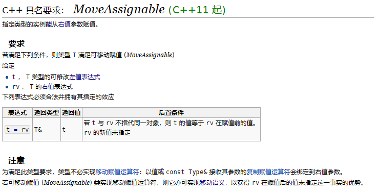

在c++中提出了这样的一个语义 `MoveAssignable`,这个语义和移动构造的语义除语法外基本相同

它的目的是为了解决右值效率的问题。

这里不讲什么叫做右值只讲他的语义带来的具体行为是什么和什么样的书写方法能满足此语义

在[C++ 具名要求： MoveAssignable (C++11 起)](https://zh.cppreference.com/w/cpp/named_req/MoveAssignable)中是这样描述的：




我们需要注意以下几点 `MoveAssignable` 

1. 并非是强保证移动赋值，这里我认为是为了兼容代码，保证左值可以像之前一样的被赋值函数所调用。
2. 返回值类型和返回值被强制要求，参数并没有被强制要求 因此只要是 const _Ty&  或者  _Ty 都可以保证 `MoveAssignable` ，我把这个称为弱约束。


和`c++`中提提供了如下的模板类：

```c++
template< class T >
struct is_move_assignable;
```

该模板用于辨别和这个差不多的场景但还是有区别的

**特性 `std::is_move_assignable` 不如可移动赋值 (`MoveAssignable`) 严格，因为它既不检查赋值的结果类型（对于可移动赋值 (`MoveAssignable`) 类型必须是 `T&` ），也不检查赋值后目标的值等于赋值前源的值的语义要求**


举个例子：

例子来源于:[std::is_move_assignable, std::is_trivially_move_assignable, std::is_nothrow_move_assignable](https://zh.cppreference.com/w/cpp/types/is_move_assignable)
```c++

#include <iostream>
#include <string>
#include <type_traits>
struct Foo { int n; };
struct NoMove {
    // 避免默认的移动赋值运算符的隐式定义
    // 然而，该类仍然可移动赋值，因为
    // 其复制赋值运算符能绑定到右值参数
    NoMove& operator=(const NoMove&) { return *this; }
};
int main() {
    std::cout << std::boolalpha
              << "std::string is nothrow move-assignable? "
              << std::is_nothrow_move_assignable<std::string>::value << '\n'
              << "int[2] is move-assignable? "
              << std::is_move_assignable<int[2]>::value << '\n'
              << "Foo is trivally move-assignable? "
              << std::is_trivially_move_assignable<Foo>::value << '\n';
 
    std::cout << std::boolalpha
              << "NoMove is move-assignable? "
              << std::is_move_assignable<NoMove>::value << '\n'
              << "NoMove is nothrow move-assignable? "
              << std::is_nothrow_move_assignable<NoMove>::value << '\n';
}


```
结果：
```
std::string is nothrow move-assignable? true
int[2] is move-assignable? false
Foo is trivially move-assignable? true
NoMove is move-assignable? true
NoMove is nothrow move-assignable? false

```